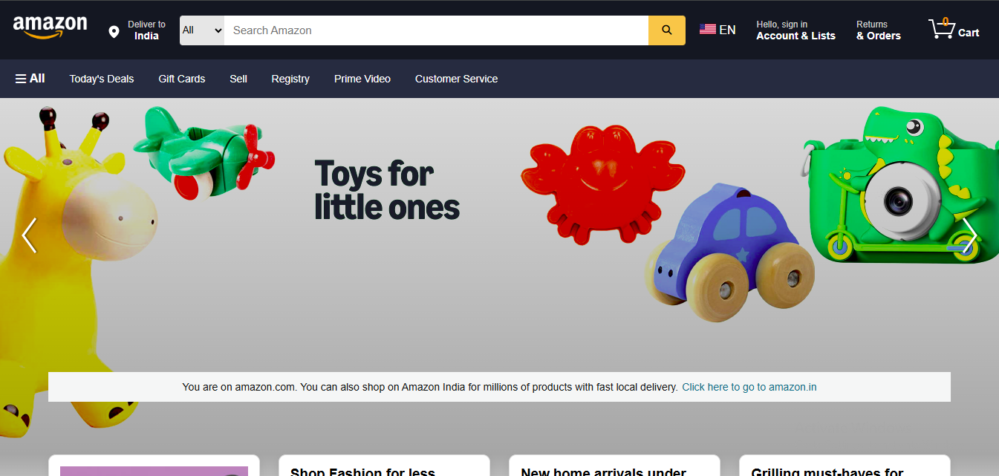
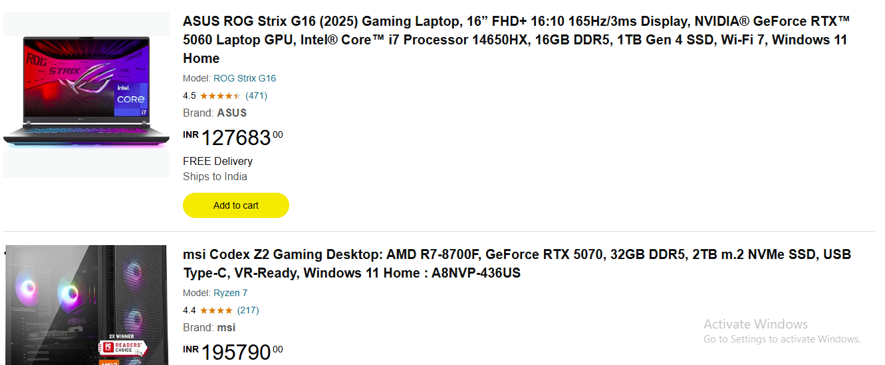
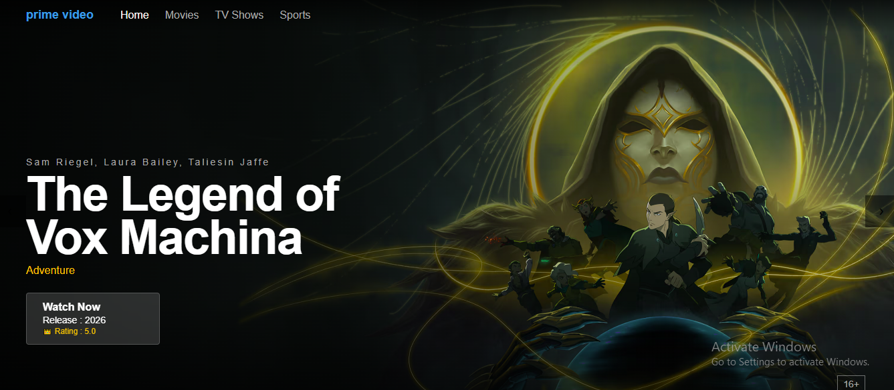
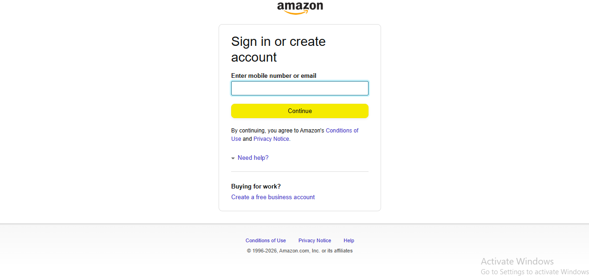

# 🛒 Amazon Clone - Dynamic E-Commerce Web Application


## 📖 Overview

Amazon Clone is a dynamic e-commerce web application inspired by Amazon. The application provides essential online shopping functionalities such as user authentication, product management, shopping cart operations, and order processing.

The project follows the MVC architecture using Java Servlets and JSP, with SQL Server as the backend database and Apache Tomcat as the deployment server.

---

## 🚀 Features

### 👤 User Management

* User Registration
* Secure Login & Logout
* Session Management
* User Profile Management

### 📦 Product Management(By DataBase)

* Product Listing
* Product Details Page
* Product Categories
* Product Search Functionality

### 🛒 Shopping Cart(Only Page)

* Add Products to Cart
* Update Product Quantity
* Remove Products from Cart
* Cart Summary

### 📋 Order Management(BY DataBase)

* Checkout Process
* Order Confirmation
* Order History Tracking

### 🔐 Admin Panel

* Add New Products
* Update Product Information
* Delete Products
* Manage Customer Orders

---

## 🛠️ Tech Stack

| Layer        | Technology         |
| ------------ | ------------------ |
| Frontend     | HTML5, CSS3, JSP   |
| Backend      | Java Servlets      |
| Database     | SQL Server         |
| Connectivity | JDBC               |
| Server       | Apache Tomcat 10.1 |
| IDE          | Eclipse IDE        |

---

## 🏗️ Project Architecture

```text
Client Browser
      │
      ▼
 JSP / HTML / CSS
      │
      ▼
 Java Servlets
      │
      ▼
 JDBC
      │
      ▼
 SQL Server Database
```

---

## 📂 Project Structure

```text
Amazon-Clone/
│
├── src/main/java/com/
│   └── saekey/
│       ├── LoginServlet.java
│       ├── RegisterServlet.java
│       ├── CartServlet.java
│       └── ....
│    
│  
├── WebContent/
│   ├── css/
│   ├── images/
│   ├── jsp/
│   └── index.jsp
│
└── database/
    └── amazon_clone.sql
```

---

## 🗄️ Database Tables

### Cooking

| Field    | Type    |
| -------- | ------- |
| C_id     | INT     |
| C_name   | VARCHAR |
| Price    | VARCHAR |
| Rating   | VARCHAR |

### Products

| Field        | Type    |
| ------------ | ------- |
| ASIN         | VARCHAR |
| ProductName  | VARCHAR |
| Price        | DOUBLE  |
| Category     | VARCHAR |
| ImageURL     | VARCHAR |

### Shows

| Field      | Type    |
| ---------- | ----    |
| ShowID     | INT     |
| Title      | VARCHAR |
| Image      | VARCHAR |
| Category   | VARCHAR |

---

## ⚙️ Installation & Setup

### Prerequisites

* JDK 17+
* Eclipse IDE
* Apache Tomcat 10.1
* SQL Server
* SQL Server Connector/J

### Clone Repository

```bash
git clone https://github.com/arbaj-silar/Amazon.git
cd amazon-clone
```

### Create Database

```sql
CREATE DATABASE amazon_clone;
```

Import the SQL file into SQL Server.

### Configure JDBC

```java
String url = "jdbc:sqlserver://localhost:1433;" +
        	            "databaseName=ProductDB;" +
        	            "encrypt=false;" +
        	            "trustServerCertificate=true";
String username = "arbajuser";
String password = "abc@12345";
```

### Run Application

1. Import project into Eclipse.
2. Configure Tomcat 10.1 Server.
3. Deploy the project.
4. Start Tomcat Server.
5. Open:

```text
http://localhost:8083/Amazon/
```

---

## 📸 Screenshots

### Home Page



### Product Page



### Prime Video



### Sign In Page



---

## 🎯 Learning Outcomes

* Java Servlet Development
* JSP Integration
* MVC Architecture
* JDBC Database Connectivity
* Session Tracking
* CRUD Operations
* SQL Server Database Design
* Web Application Deployment

---

## 🔮 Future Enhancements

* Payment Gateway Integration
* Wishlist Functionality
* Product Reviews & Ratings
* Email Notifications
* Responsive Mobile UI
* REST API Development
* Spring Boot Migration

---

## 👨‍💻 Author

**Your Name**

* GitHub: https://github.com/arbaj-silar
* LinkedIn: https://www.linkedin.com/in/arbaj-silar-9b158a3a7/

---

## 📄 License

This project is developed for educational and learning purposes only.

**Disclaimer:** This project is inspired by Amazon and created solely for learning web development concepts. It is not affiliated with Amazon in any way.
